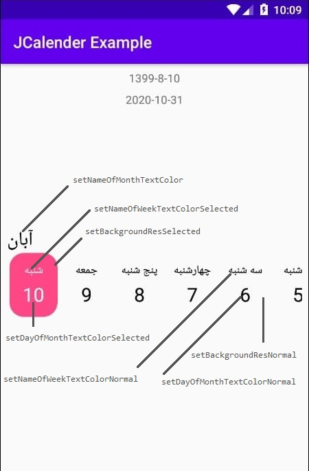
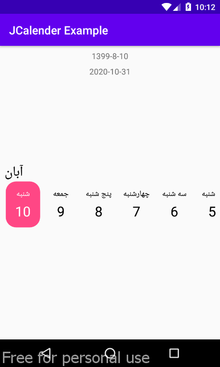

# JCalendar

JCalendar is an Android library for displaying one month later and a month ago from the device's current date.
## Screenshot and gif

</img> 
</img> 


## Installation

Step 1. Add the JitPack repository to your build file.
Add it in your root build.gradle at the end of repositories:
```groovy
allprojects {
   repositories {
      ...
      maven { url 'https://jitpack.io' }
   }
}
```
Step 2. Add the dependency
```groovy
dependencies {
	implementation 'com.github.Muhammad-Javad:JCalender:0.0.1-alpha'
}
```
## Usage
First of all, you must add JCalendar to your layout.
```xml
<androidx.constraintlayout.widget.ConstraintLayout 
    xmlns:android="http://schemas.android.com/apk/res/android"
    xmlns:app="http://schemas.android.com/apk/res-auto"
    xmlns:tools="http://schemas.android.com/tools"
    android:layout_width="match_parent"
    android:layout_height="match_parent"
    tools:context=".MainActivity">

        <com.javadsh98.jcalendar.JCalendarView
        android:id="@+id/jcalendar"
        android:layout_width="0dp"
        android:layout_height="wrap_content"
        app:layout_constraintBottom_toBottomOf="parent"
        app:layout_constraintEnd_toEndOf="parent"
        app:layout_constraintStart_toStartOf="parent"
        app:layout_constraintTop_toTopOf="parent" />

</androidx.constraintlayout.widget.ConstraintLayout>
```

### Code
you can access JCalendar in activity or fragment by following code.
#### Kotlin
```kotlin
jcalendar
    .setBackgroundResNormal(ResourcesCompat.getDrawable(resources, R.drawable.frm_item_normal, null)!!)
    .setBackgroundResSelected(ResourcesCompat.getDrawable(resources, R.drawable.frm_item_selected, null)!!)
    .setNameOfMonthTextColor(R.color.black_all)
    .setNameOfWeekTextColorNormal(R.color.black_all)
    .setDayOfMonthTextColorNormal(R.color.black_all)
    .setNameOfWeekTextColorSelected(R.color.white_all)
    .setDayOfMonthTextColorSelected(R.color.white_all)
    .setJalaliListener(object : JJalaliListener {
        override fun onJalali(date: String) {
            textView_jalali.text = date
        }
    })
    .setGregorianListener(object : JGregorianListener {
        override fun onGregorian(date: String) {
            textView_gregorian.text = date
        }
    })
    .init()
```
#### Java
``` java
JCalendarView calendarView = findViewById(R.id.jcalendar);
calendarView
        .setBackgroundResNormal(ResourcesCompat.getDrawable(getResources(), R.drawable.frm_item_normal, null))
        .setBackgroundResSelected(ResourcesCompat.getDrawable(getResources(), R.drawable.frm_item_selected, null))
        .setNameOfMonthTextColor(R.color.black_all)
        .setNameOfWeekTextColorNormal(R.color.black_all)
        .setDayOfMonthTextColorNormal(R.color.black_all)
        .setNameOfWeekTextColorSelected(R.color.white_all)
        .setDayOfMonthTextColorSelected(R.color.white_all)
        .setJalaliListener(new JJalaliListener() {
            @Override
            public void onJalali(@NotNull String date) {
                TextView jalali = findViewById(R.id.textView_jalali);
                jalali.setText(date);
            }
        })
        .setGregorianListener(new JGregorianListener() {
            @Override
            public void onGregorian(@NotNull String date) {
                TextView gregorian = findViewById(R.id.textView_gregorian);
                gregorian.setText(date);
            }
        })
        .init();
```

## Contributing
Pull requests are welcome. For major changes, please open an issue first to discuss what you would like to change.

Please make sure to update tests as appropriate.
## Related Links
<a href="https://github.com/jhonnyx2012/HorizontalPicker">Horizontal Picker</a>
<br/>
<a href="https://github.com/eloyzone/jalali-calendar">jalali-calendar</a>
<br/>
<a href="https://developer.android.com/studio/write/java8-support-table">Use Java-8 apis in the android</a>
<br/>
<a href="https://medium.com/@douglas.iacovelli/the-beauty-of-custom-views-and-how-to-do-it-79c7d78e2088">The beauty of Custom Views in Android and How to do it!</a>
<br/>
<a href="https://medium.com/@anujguptawork/how-to-create-your-own-android-library-and-publish-it-750e0f7481bf">How to create your own Android Library and publish it</a>
